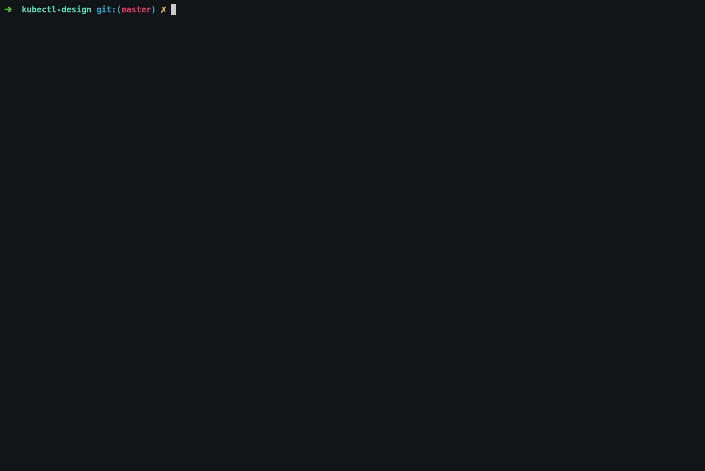

# kubectl-design

kubectl-design helps to generate kubernetes resource yaml definations using
command line options and opens it in your editor to edit it and use it.

A simple tool to save your time.

__version compatiblity : kubectl v1.18.x__

#### Installation:

```
go get -u github.com/kunalkushwaha/kubectl-design
```


#### Usage:

Replace `create` & `run` with `design`

__kubectl ~~create~~design deployment busybox --image busybox__

```
kubectl design [resource-name] [options]

$ kubectl design deploy test --image busybox
```



#### Configure prefered Editor.
- `kubectl-design` uses environment variable `EDITOR`, so it can be used to set prefered editor  
  - `vim` is default editor, if no `EDITOR` is not set.
```
$ export EDITOR=nano
```

#### Resources Supported

```
  clusterrole         Design a ClusterRole.
  clusterrolebinding  Design a ClusterRoleBinding for a particular ClusterRole
  configmap           Design a configmap from a local file, directory or literal value
  cronjob             Design a cronjob with the specified name.
  deployment          Design a deployment with the specified name.
  job                 Design a job with the specified name.
  namespace           Design a namespace with the specified name
  poddisruptionbudget Design a pod disruption budget with the specified name.
  priorityclass       Design a priorityclass with the specified name.
  quota               Design a quota with the specified name.
  role                Design a role with single rule.
  rolebinding         Design a RoleBinding for a particular Role or ClusterRole
  secret              Design a secret using specified subcommand
  service             Design a service using specified subcommand.
  serviceaccount      Design a service account with the specified name
```

Your feedback is welcome, feel free to create issues and PRs.
